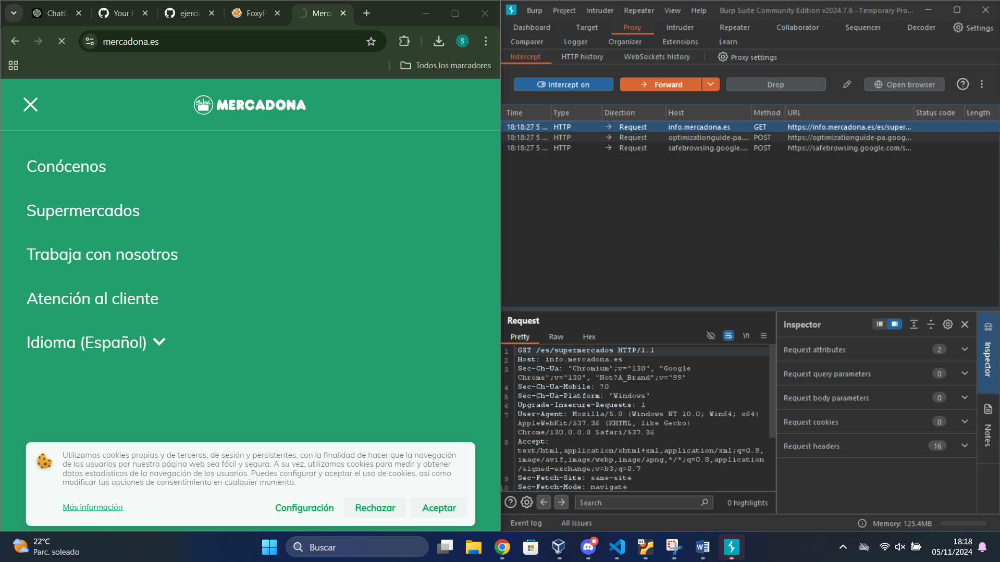

# Trabajo con Burp Suite

Hemos estado trabajando con **Burp Suite**. Para usarlo, es necesario instalar la extensión **FoxyProxy** y los certificados. Básicamente, hemos utilizado el proxy.

Cuando queramos parar el tráfico, activamos **Intercept On** y recargamos la página. Nos aparecerán todas las llamadas, lo que es muy útil para conocer las solicitudes HTTP que hacemos a las páginas.

Aquí podemos ver todo el historial de las llamadas HTTP que hemos realizado. 

Lo más importante que hemos hecho es un método para adivinar usuarios y contraseñas.

- Si conocemos el usuario y la contraseña, no es necesario realizar un ataque.
- Damos clic en **Sniper**, seleccionamos la contraseña y cargamos en el **Payload** el diccionario. Seleccionamos solo la contraseña y añadimos un diccionario para que pruebe todas las contraseñas con un usuario.

Si queremos probar tanto el usuario como la contraseña a la vez, podemos hacerlo de la siguiente manera:

En cada posición del payload, colocamos un diccionario: uno para usuarios y otro para contraseñas.

